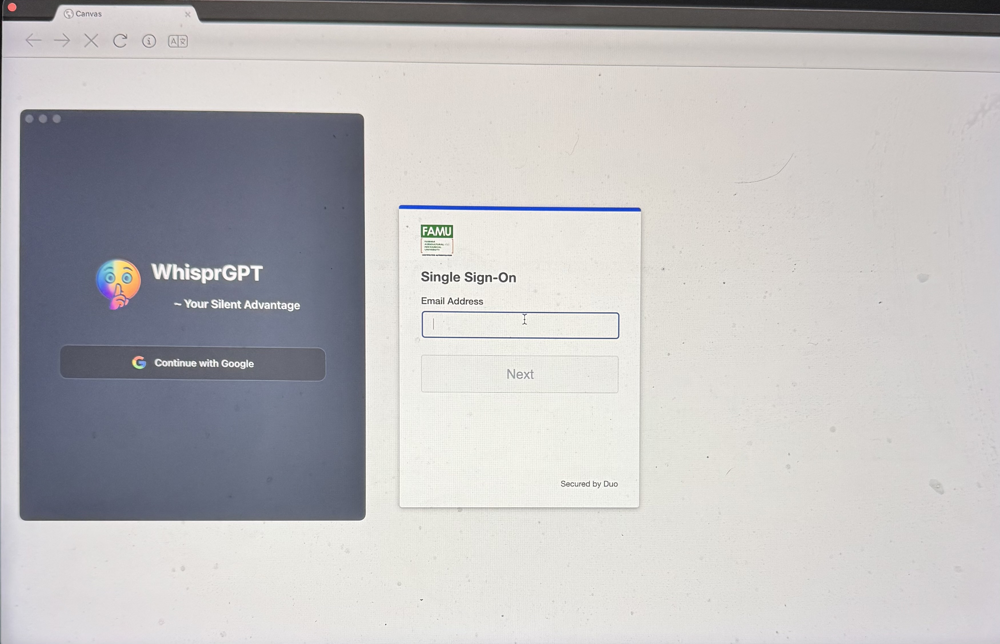

# WhisprGPT Self-Signing Script (macOS)

## ✅ Requirements
- macOS (tested on Sequoia)
- Built-in macOS tools: `security`, `openssl`, `codesign`, `xattr`, `spctl`  (no extra installs required)

## ▶️ Steps To Do Before Buying Subscription

### 1. Download and Install "Special Lockdown Browser Version"
- Download the latest **DMG** file from the release page (or from the link you were given).  
- Open the DMG and drag **WhisprGPT.app** into your **Applications** folder.

### 2. Run the Self-Sign Script

1. **Download the script directly:**
   - Open this repository in your browser.  
   - Click on `self_sign.sh`.  
   - Click the **Download raw file** button (or right-click → *Save As…*).
     
   - Save it into your **Downloads** folder.

2. **Open Terminal** (press ⌘ + Space → type *Terminal* → Enter).

3. **Navigate to Downloads**:
   ```bash
   cd ~/Downloads
   ```
4. **Make the script executable:**
   ```bash
   chmod +x self_sign.sh
   ```
    
5.  **Run the script:**  
    Copy and paste the command below into Terminal, then press **Enter**: <br />
    ⚠️ NOTE: In the [YouTube Installation Video](https://youtu.be/t2cnGZuFLbg?si=cMzt-At5l-LWNan7) I typed my password inside the terminal, YOU WILL NOT NEED TO DO THAT HERE
    
    ```bash
    ./self_sign.sh
    ```
    
    ### 🔧 Troubleshooting  
      If you see an error like this after running:  
      
      > codesign.key: Permission denied
      
      OR *macOS* still says the app is damaged, rerun the script with **sudo** and click **Enter**:  
      ⚠️ NOTE: In this case, you **will need to enter your Mac password**.  
      ℹ️ When typing your password, **nothing will appear on screen** (no dots or characters) — this is normal macOS security behavior.  
   
      ```bash
      sudo ./self_sign.sh
      ```
### 3. Open and verify that WhisprGPT Works On Intended Platform


  Enjoy the full WhisprGPT experience 🚀

## ⚠️ Software License & Disclaimer ⚠️

This software is provided **"as is"**, without warranty of any kind, express or implied.  
The developer shall **not be held responsible** for:

- Any misuse of this application in academic, corporate, or legal settings.  
- Any damages, data loss, or consequences resulting from malfunction or errors in the software.  
- Any violations of third-party policies, terms of service, or codes of conduct.

By using this software, you agree to take full responsibility for how you use it.


**WhisprGPT – Stay sharp. Stay silent.**
